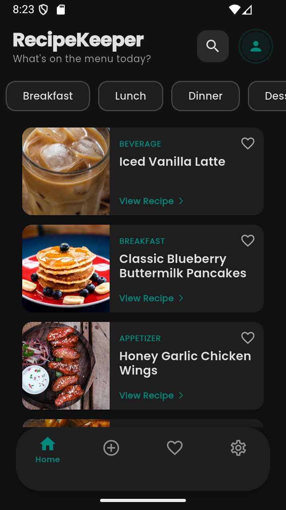

# RecipeKeeper
RecipeKeeper is a personal kitchen assistant built with Flutter that helps users organize, save, and discover recipes in one place.

## Features
- Browse community recipes
- Save favorite recipes
- Create private family recipes
- Clean and user-friendly UI

## Built With
- Flutter
- Dart
- Firebase

## Getting Started
This project is a Flutter application.
